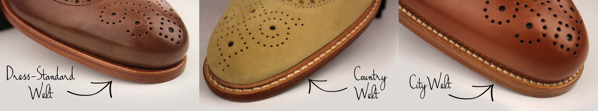

# 3D Designing Tool

The private label 3D designing tool is the core of our MTO program. It works on any web browsers, and allows you to [customize ](../submit-a-new-order/#place-an-order)any of the base styles and [submit the MTO or BULK order to production](../submit-a-new-order/).

## **Style Selection**

On the main selection screen, use the categories on the left menu to narrow down your search, and select the style / construction you would like to start customizing.

## **Style Customization**

### **Material Selector**

The material menu is located on the top bar. Select the piece of the shoe by clicking on the actual piece, and then change the material from the available list. Material restrictions may apply to different item pieces.


Learn more about our available [Leathers and Fabrics](../../production/materials-and-construction.md) for MTO & BULK production.


### **Burnishing Effect**

You can add a "Burnishing" effect on selected leathers by using the Burnishing Widget selector.

> In shoemaking terminology, burnish is the term for adding an antiqued effect on leather shoes to create a variation in shades. The process of burnishing is meant to bring out the highs and the lows of the shoe, strongly focusing on drawing out the depth of the leather. Burnishing helps in giving the shoes a look of superior quality and exclusiveness.

While creating your style on the 3D Designing Tool, the burnishing widget will appear on the left side of your screen. Bear in mind that the 3D visualization is just an approximate representation of the finishing effect. Burnishing is an artisan hand-made technique, which ensures that each pair will be totally unique.

### **Patina Intensity**

The Patina Intensity selection widget will be shown on the 3D Tool while customizing an item with patina finish. Two intensity levels are available: **Standard** and **Dark**, with darker shadows and dimmer tones

> The "intensity" of the patina is the amount of shadow or aging effect applied. It could be comparable to the burnishing effect on standard leathers.

Learn more about the artisan processes and craftsmen behind our patina workshop:


[handmade-patina-workshop.md](../../production/handmade-patina-workshop.md)


### **Sole Units**

You can choose any of the available sole units using the sole selector widget located on the bottom right of the 3D Designing Tool.


Available sole units shown on the widget will depend on the actual style being configured


Lear more about the different [Sole Units](../../production/construction-and-heritage.md#sole-units) available on our MTO program, and other production and construction details on the following article:


[construction-and-heritage.md](../../production/construction-and-heritage.md)


### **Heel Height**

On certain goodyear welted shoe styles and sole units, you will be able to choose between the standard heel and a higher heel. Look for the accessories configuration tab, on the right bottom part of the 3D designing tool. Note that the heel selector will be displayed based on the style and sole unit being used at the moment.&#x20;

### **Welt Styles**

You can choose between  different welt styles using the Welt Style widget, shown on the bottom right panel of the 3D Tool.

> In well-constructed shoes, the welt is a strip of leather which runs along the perimeter of the outsole. Its primary function is to attach the upper to the outsole and create a greater durability.

Available welt styles are different depending on the shoe and outsole selected. Some welt styles can be further customized with different colors.The welt color might changed independently of the sole color. Although it is totally up to you, it is possible to match the color of the outsole and the welt.

Use the Welt Widget selector on the bottom right of your 3D Designing Tool to alternate between available welt styles.

### **Toe Caps & Brogue**

On some specific shoe styles the toe can be customized with a cap toe, a brogue toe, etc. If this customization is feasible the Toe Cap selector widget will appear on the bottom right of the 3D Designing Tool.

### **Slipper Ornaments**

Slippers can be customized with different ornaments including Tassels, Albert Touch, Mask and Bit. Use the Accessories Tab on the bottom right menu of your 3D Designing Tool to choose from the available accessories, and change the material of the ornament after.

### **Embroideries**

Men’s and Women’s Slippers can be designed with embroideries / motifs / logos on the upper vamp. Using our 3D Designing tool, you will be able to access our current embroidery repository, which is quite large and includes dozens of designs with all kind of motifs.&#x20;

Motifs can be placed and positioned on the upper vamp using the 3D Designing Tool. The embroidery design widget is located on the Accessories tab, on the bottom right part of the screen. Default motif designs are included in all MTO platforms.

### **Monogramming**

Slippers can be embroidered with up to 3 initials on the side. Initials can be made in different font styles and colors. Use the right bottom panel "Side" to add the initials.

### **Stencil Art**

**Stenciling** is a technique for reproducing designs by passing ink or paint over holes cut in cardboard or metal onto the surface to be decorated. This handmade technique is carried out pair by pair in our facilities. Each piece cut is hand painted with special paints developed for this purpose by means of templates created by Bespoke Factory.


Bear in mind that the aim of the 3D representation is to be as close to reality as possible. However, the result in some painted areas may not be totally precise when applying the paint, which is completely normal as it is an artisan graffiti process.


#### How does it work?

The Stencil Control Widget is be located on the left part of the 3D Designing Tool. Using the buttons on the left, you will be able to jump between shoe pieces, and select the texture and color of the stencil to be applied.&#x20;

Customization is individually applied for each shoe piece, however, you can use the "Apply All" button to select the same pattern and color to be applied to every customizable shoe piece.&#x20;


Stencil Art - 3D Tool Tutorial



Remember that you can also submit your own custom stencil artworks. See [Custom Stencil Motifs](../../production/order-customization.md#custom-stencil-motifs) article on the [Additional Customizations](../../production/order-customization.md) section.


#### The Stencil Types

We offer three types of stencil designs: **Sticker**, **Background** and **Camo**. The **Sticker** is a simple design, that is placed individually in one of the shoe pieces. The **Background** is a repetitive pattern, which is applied to the whole shoe piece. The **Camo** is a special type of **Background** that is made out of multiple layers. Each of these layers can be individually customized with your desired color.

#### The Stencil Motifs

After selecting a shoe piece using the Stencil Widget on the left, you will be able to select the motif or texture of the stencil to be applied. Each shoe piece is designed individually, so you can have multiple stencil designs on the same shoe.

#### The Stencil Color

After selecting a shoe piece using the Stencil Widget on the left, you will be able to choose the color of the stencil being applied on the bottom right panel. You can change the color individually, for each shoe piece, and click on the "Apply to all" button to apply the selected color to all shoe pieces.&#x20;

####

## **Main Interface**

### **Product Info**

Use the top link "Product Info" to display a screen with detailed information about the style being displayed on screen, including lifestyle and studio pictures of real shoes.

### **Share and Save a Design**

Using the "Share" button on the top bar of the 3D Designing Tool you will be able to obtain an URL link to that particular style that you just created.&#x20;

This feature can be used to share your designs by email, whatsapp facebook, etc, but it can also be used to save your own designs for later use, for example by bookmarking the design url on your browser.

### **Price Widget**

Manufacturing prices for MTO (single order) production as well as wholesaler costs for BULK production (small batches of 10 items per style) are shown on the top right corner of the 3D Design Tool. [Learn more about our Production Methods](../../production/pricing-and-production-methods/).

Manufacturing prices for MTO (single order) production as well as wholesaler costs for BULK production (small batches of 10 items per style) are shown on the top right corner of the 3D Design Tool. [Learn more about our Production Methods](../../production/pricing-and-production-methods/).

The MTO price is static for each style, whereas the BULK price is dynamic, it will be updated live according to the current design being created, which materials are used, how much material is used, etc.&#x20;

The MTO price is static for each style, whereas the BULK price is dynamic, it will be updated live according to the current design being created, which materials are used, how much material is used, etc.&#x20;

### **Order Confirmation Check**

When you are satisfied with the final look of your design, click on "Order" to begin the order checkout process. However, in order to proceed, you will be required to confirm a check list of all materials (one-by-one)

