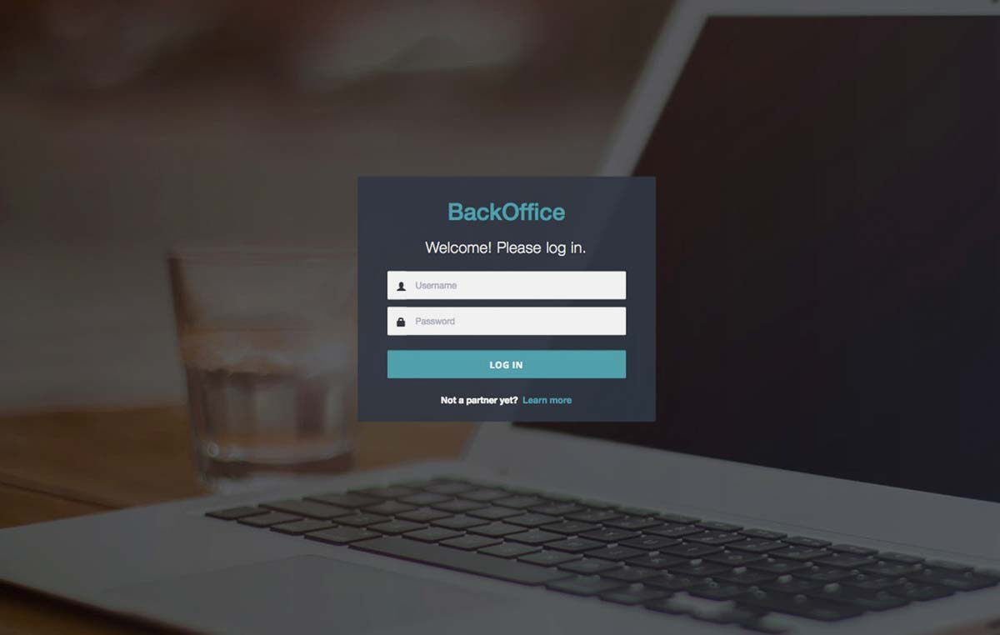
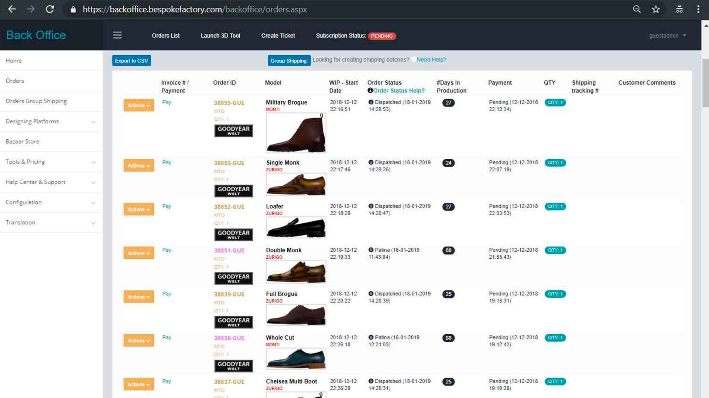
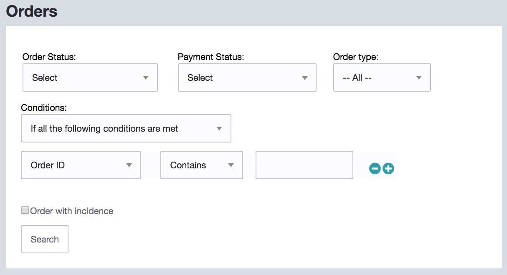

# Manage Orders

## Access your Backoffice

Through the [Admin Backoffice](https://backoffice.bespokefactory.com/) you will be able to submit and manage all your orders, as well as submit payments, manage invoices, track live status of your orders, generate reports, etc. To access your [Admin Backoffice,](https://backoffice.bespokefactory.com/) please, login using your admin credentials.&#x20;

Admin credentials should have been sent to you via email, if you have lost your credentials or have never received this welcoming email, please, [contact us](http://bespokefactory.com/contact) to recover your username and password.

## Main Order Pool

The main order pool is the core of the [Admin Backoffice,](https://backoffice.bespokefactory.com/) each time a new order is submitted, it will show up on your main order pool. Each order is assigned a unique incremental Order Number, followed by the 3 letters code of your company, for example: “12345-BFG”. The order number helps you identify any particular order, each one being either a single MTO order, or a batch of BULK orders.

For each order (row) displayed, there are a few data columns with useful information and links:

* **Invoice**: When the payment is made, you will be able to review and download the associated invoice of this particular order.
* **WIP Start Date**: Refers to the date when the order was launched to production
* **Model**: The actual model or style of the item.
* **Order** Status: The actual manufacturing status of your order, which is updated in real-time.
* **Days in Production**: Number of calendar days since the order was launched to production.
* **Payment Status**: The payment status of your order.
* **Quantity**: The actual quantity of the order. Individual (MTO) orders are always Qty:1, however, a BULK order might consist in 10, 20, 50, etc items per order.
* **Shipping Tracking:** Once the order is scheduled for collection, the individual tracking number will appear here, so you can track the progress of the parcel online.

### Search and Filter

Using the provided filters on the top of the main pool, you will be able to filter the results. You can search by order number, payment status, manufacturing status, model, etc.

### Manufacturing Status

Order status of all your orders are updated in real-time with the actual manufacturing stage on the factory. There are several Order Statuses on which a particular order might be at a given time. Click or hover the cursor over the Order Status of the order to get a more detailed information of the meaning of that status.

### Cancel orders

You can cancel unpaid orders at any time free of charge, by click on the “Actions” button next to the order number and click on “Cancel Order”. Order will be marked as cancelled and you will stop seeing and receiving automated notifications about pending orders on your pool.

Orders that are already paid by your side might also be cancelled free of cost during the following hours after the payment is submitted, as long as the order did not reach the “Received” status. Click on the “Actions” button next to the order number and click on “Cancel Order”. Please, send us a support ticket after cancellation for your full payment amount to be credited back to your account.

Orders that were paid and already launched to production (Received, Cut, Sewing Department, etc) are not eligible for a free cancellation. If you would like to cancel an order that is currently under production, there will be a cancellation fee to cover for raw material expenses and partial labour work. This cancellation fee will usually be between 50 to 90 EUR, but might go up to 100% of the original amount depending on the order status and the particularities of each order. Cancellation fees will be calculated for each order separately by our team.

### Clone orders

You can repeat a previously submitted order using the Actions button. The order will be manufactured with the same specifications of the first order. However, please bear in mind that we are constantly improving our production processes, raw materials and hand dyeing & finishing procedures. When trying to re-order a previously submitted design, the resulting one might slightly differ from the original due to the reasons above or simply because each hand painted cut is unique and not reproducible in the same exact way, especially if it involves and order that was produced a long time ago.
