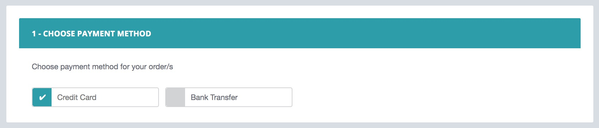
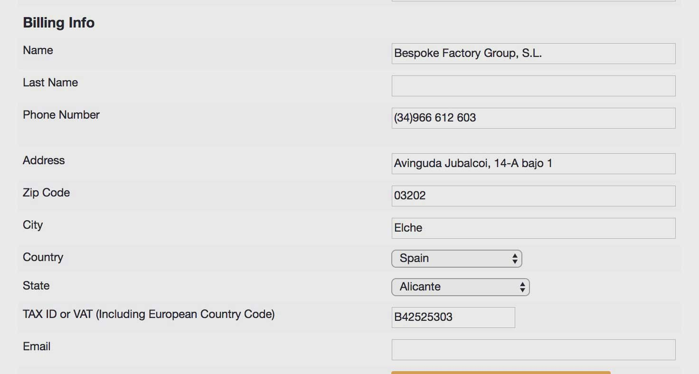
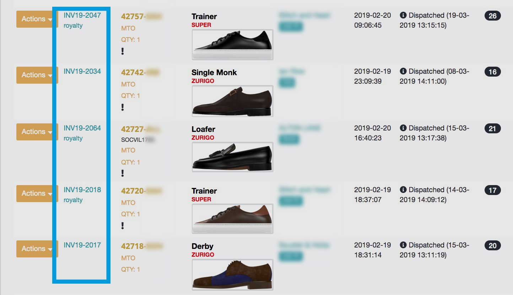

# Payments & Invoicing

## **Payment Methods**

Orders are paid through the Admin Backoffice. See article [How to submit an order](submit-a-new-order/#pay-an-order).&#x20;

When paying an individual order, or a group of orders, you will presented with the order summary, and asked to choose between Credit Card and Bank Transfer payment methods



### Credit Card Payment

Payments can be made using a credit or debit card. Supported cards are Visa, Mastercard and American Express.

#### Rejected Card Payment

There are many reasons for a transaction to fail, please check the info below and try again:

* **Wrong card data:** please try again, and make sure you enter exactly the same information printed on the card
* **Credit/debit limit**: some cards have a daily/monthly transaction limit (for ex. 600 EURO), for security reasons: please, contact your bank or try with another card
* **Other issues:** Using not-supported cards, country of origin mismatch, address verification failed, etc. Please, try again with another card.

Please, note that if you see any charge or movement in your bank account balance after a failed transaction, means that your bank is temporary holding the funds. We recommend that you ask your bank account manager regarding those kind of issues.

### Bank Transfer Payment

You can also submit payments using a bank transfer. Please, bear in mind that the production of your order will not begin until our bank confirms that payment has been received. **This process may take up to 7 working days.**

Specific instructions will be shown on screen when selecting Bank Transfer. Please, follow them in order to avoid potential delays on your orders.

## **Split Payments**

Some invoices can be split in two equal payments. Only invoices with a total amount greater than 1,499.00 EUR are eligible for split payment, however, the available payment options might depend on other factors.

The split payments will be always scheduled as follows:

* First Payment: The first payment is required in order to launch the order to production. Until the first payment is received, the order will not be launched to production. Once the first payment is received, the order is automatically sent to production.
* Second Payment: Second payment is required in order for us to ship the finished order to you. That is, 100% of the total invoice amount should be cleared before shipping. Merchandise that is either unpaid or partially paid, is not eligible for shipping.

## **Invoicing & Taxes**

Our company follows the European and Spanish policies about taxes.&#x20;

* **Non-European Business:** _all our invoices will be issued with 0% VAT / TAX_
* **European Business**
  * **With a valid EU-VAT number:** _all our invoices will be issued with 0% VAT / TAX_
  * **Without a valid EU-VAT number**: _all our invoices will be issued with 21% VAT / TAX_

### **Edit your billing info**

To add or modify your Billing Information, access your backoffice and select&#x20;

```
Configuration > Account Settings
```

Remember that a valid VAT / TAX ID is required for European business.



## **View & Download Invoices**

Invoices are issued after a payment is completed. You can view and download all invoices on your Admin Backoffice. Orders that are already paid will display the associated invoice on the first column.



