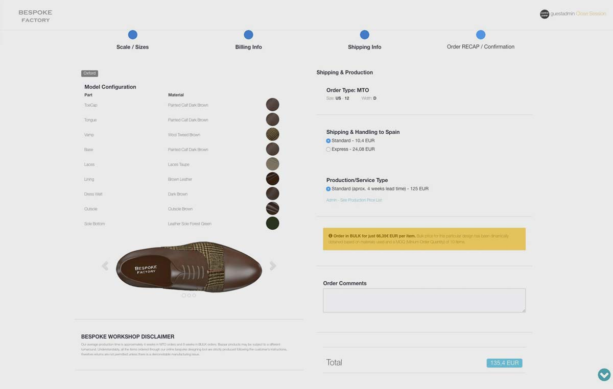
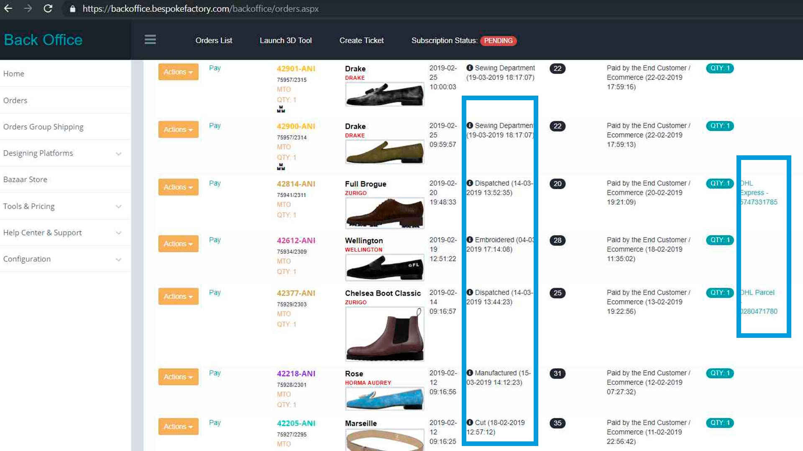
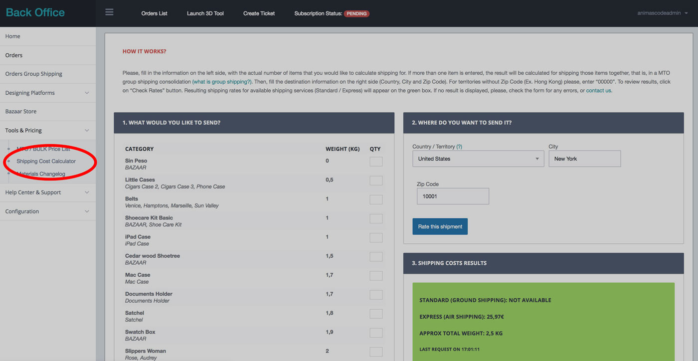

# Shipping & Handling

## Dropshipping

We can ship orders to your customers on your behalf using blind drop shipping. This means that no invoices, packing slips, or documentation is actually included on the parcel itself. Shipping labels will display your business name, avoiding all mentions to "Bespoke Factory".

## Grouped vs Individual Shipping

You can decide whether to ship your MTO orders individually, that is, ship each order separately right after it's finished, or group several MTO orders together and ship all of them in one batch when all of them are finished.

Learn more about the [Group Shipping](group-shipping.md) feature, and how to group orders together.


[group-shipping.md](group-shipping.md)


## Shipping Methods

We ship worldwide using UPS and DHL, however, specific regions and territories might not be covered. Please, refer to the checkout form for a full list of available destination countries and territories.

Available shipping methods will be shown during order checkout. Depending on the items being shipped and the destination country, the available shipping methods will vary.

Once the order is ready to be shipped, we will usually pack and process the shipment in 24-48h. Your pair will be shipped from our factories in Spain. Transit time depends on your delivery address. The majority of the orders are delivered in about 1-4 days.

## Tracking Numbers

Dispatched orders on your main order pool will display specific tracking URLs, that you can use to track the parcel online

## **Shipping and Cost Calculator**

The associated shipping cost of an order is calculated and shown during the final checkout (before payment) and is based on the volume of the items being shipped, and your shipping destination. Rates are obtained in real time via API.

Use the Shipping Cost Calculator tool on your Admin Backoffice to get an approximate quote of the shipment. However, bear in mind that the actual shipping cost will be calculated during the checkout process

## **Customs taxes and duty fees**

Bear in mind that the receiver of the parcel is responsible for import duty, taxes and documentation required by the customs agency of the receptor country.&#x20;

Some countries, like United States, do not charge any import duty or taxes on individual shipments with commercial value of less than 800 USD. The previous threshold and exact procedures vary between different countries and regions.

An special case is Canada, where all imports from / to Europe are duty free. Learn more on [Canada CETA Agreement](canada-ceta-agreement.md) article.

