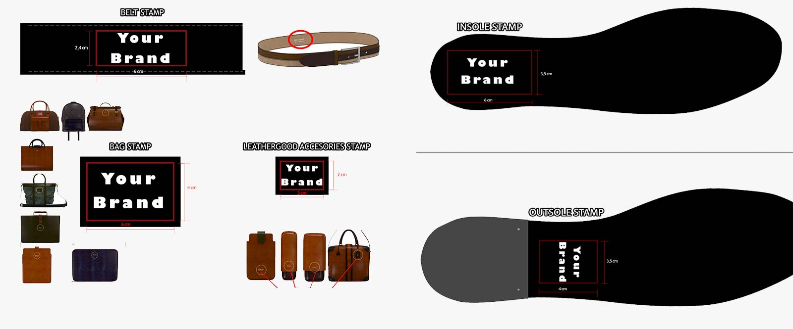

# Custom Stamps

### Embossing Your Brand

You can **develop your own custom stamps** to **engrave your orders** with your brand’s logo.

You may want to skip this step and receive your first sample order(s) unlabeled, that is, no logos engraved on the products. Otherwise, you should **develop your own stamps.**

There will be a one-time fixed-cost to develop your stamps, which will be used an all future orders.

Every time you submit a new order, our system automatically checks if we have already developed all the necessary custom stamps to engrave that particular item with your brand.

If it turns out that you don’t have them yet, a warning message will popup, asking you to choose between continuing with the order (unlabeled) or add the custom stamps kit required to emboss that particular product.&#x20;

### Purchasing a Stamps Kit&#x20;

By default, our system will detect the stamps required to engrave the particular product (or set of multiple products) that you are trying to pay for, and suggest the most appropiate stamps kit. However, you can go ahead and buy the stamp kit from the Bazaar Store by yourself, on a separate purchase.

Remember that this is just a **one-time fixed cost** to develop and produce the iron molds required to heat-engrave all orders produced under your brand.&#x20;

Please, make sure you follow the instructions after the payment, to avoid delays in your orders.

### Image File Requirements

In order to develop your stamps after purchasing the kit, we will **require a vector file of the logo** from your side (for example .eps, .svg, .pdf) in **plain black color over white background**. Colors or tone gradients are not supported. Find here a quick explanation of the [differences between an image and a vector file](http://image420.com/what-is-vector-art), and why we need them.

Bear in mind that we do not PRINT your logos on the leather (sole, insole…etc). We use heat-pressure embossing. As you can imagine, embossing something on leather leads to small details not being much appreciable. We always suggest to avoid thin strokes and small text. To maximize stamping quality, please, **use simple logos with thick strokes** and text with at least 2 mm in height

If you don’t have access to this kind of vector image file, please, ask your design studio / designated person to provide this for you.

### Artwork Confirmation

Having received the payment of the stamps, and your logo image file, our team will create a set of artworks to confirm size, position and orientation of each stamp.

All our stamps are embossed, either by pressure (leather) or laser (rubber)

### Launching to Production

Once the custom stamps order is paid, your logo is received, and the artworks are confirmed, the stamps order will be sent to our artisans, who will develop all the necessary molds. At the same time, automatically, all orders placed that were being kept on hold will be launched to production at the factory.

It’s worth noting that **all orders that need stamps will be kept on hold until the required stamps are confirmed and launched to production.**


Please, bear in mind that orders which are being kept on hold “Waiting For Customer Logo / Validation” for a period longer than 10 days might be launched to production UNLABELED without any further notification, to avoid potential delays on your samples


### Unlabeled Orders

Note that every time you place an order, we will check for the associated stamps. If no customs stamps for that particular item have been developed yet, you will receive an on-screen notification asking for instructions of whether you want to place the order unlabeled, or develop your custom stamps. If you select to continue unlabeled, your order will be shipped with any logo embossed.

Please, contact back to your account manager or create a support ticket from your [Admin Backoffice](https://backoffice.bespokefactory.com/) to communicate with us regarding any issue.

## Special Embossing for Sneakers

Special Embossing for Sneakers is a remarkable feature that allows you to elevate your brand by showcasing your logo on multiple spots of the sneakers. By following the steps outlined in this guide, you can seamlessly incorporate your logo onto the tongue, side and/or back piece.&#x20;

Note that this is just for tongue, side and backpiece embossing. The sole and insole stamping is already managed by the sole/insole standard stamps, which are used in all shoes, including sneakers.

Take advantage of this exciting feature and create truly unique and personalized sneakers that align with your brand's vision

#### Getting Started

To begin the process of Special Embossing, follow these steps:

* Get in touch with our team: Contact our dedicated support team to express your interest in Special Embossing for your sneakers.
* Share your logo: Provide us with your logo in a high-resolution format, ensuring it meets our guidelines for optimal embossing quality.
* Specify embossing spots: Indicate the specific locations where you want your logo embossed on the sneakers—choose from the tongue, side, and/or back piece.

#### Embossing Styles

Choose between the two embossing styles:

* **Standard Embossing:** This classic style utilizes precise pressure to beautifully embed your logo into the material of the sneaker.
* **Color Embossing:** Make a statement with our Color Embossing options, available in elegant **gold** or **silver**. This style adds a touch of sophistication and flair to your sneakers.

#### Artwork Preview and Confirmation

Our expert designers will create an artwork preview incorporating your logo and chosen embossing spots. You will receive this preview for your review and confirmation. Take this opportunity to ensure that the placement and size of the embossing align with your vision.

<figure><figcaption></figcaption></figure>

#### Quotation and Stamp Production

Upon your confirmation of the artwork, we will provide you with a detailed quotation for the production of custom embossing stamps. These stamps are crucial for achieving consistent and precise embossing across your sneaker orders.

#### Integration and Customization

Once you have purchased the embossing stamps, we will seamlessly integrate your logos into our 3D designing tool. This integration ensures that your embossed logos are readily accessible for customization during the design process. You can visualize and personalize your sneakers with the embossing, creating a unique and branded product.

#### Embossed Sneaker Production

With the embossing stamps set up in our production process, every sneaker manufactured will bear your embossed logo according to your specifications. Our skilled team will ensure that each pair of sneakers reflects the quality and attention to detail that your brand deserves.

#### Troubleshooting and Support

If you encounter any difficulties or have questions regarding the Special Embossing feature, our dedicated support team is here to assist you. Visit our Help Center or reach out to us via customerservice@bespokefactory.com for prompt and comprehensive assistance.

