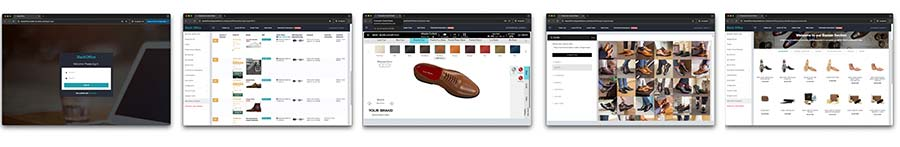

# Getting Started

#### In This Article: Quick Highligts ⚡️

* 🔗 **Access Your Tools**: Log to your Admin Backoffice, 3D Design Tool, and Get Inspired platform
* 🏭 **Production Methods**: Learn about our Standard, Fastlane, and Rush MTO options
* 🏷️ **Your Brand**: Add your logos and branding to all your products
* 🎨 **Customization**: Personalize with custom packaging, unique materials, and more
* 📝 **Set Up Account**: Enter billing, shipping, and other details
* 📦 **Shipping Options**: Discover our shipping methods and how to save on costs with group shipping.
* 🎁 **Subscription & Promo**: Find out how the subscription works and take advantage of our 15-day free trial plus free shoe trees
* 🥇 **Your First Order**: Learn how to design, submit, and pay for your first order


**Need help?** Contact your account manager, or schedule a meeting or a call with them


## Welcome to Bespoke Factory!

In this guide we will help you access your admin backoffice and design tools, set up your account, and submit your first MTO sample order.


**Don't have an account yet?** [Contact us](https://help.bespokefactory.com/get-help/contact-us) to get started


## Access Your Tools

<figure><figcaption></figcaption></figure>

First, the **Admin Backoffice** is the place where you will manage orders, payments, invoices, and track order status.


Access the backoffice at [https://backoffice.made-to-order.com](https://backoffice.made-to-order.com) and log in with your credentials.


From the **main menu** you’ll also be able to access all tools and platforms:

* **3D Designing Tool:** your private labeled 3D tool to browse our full catalog, design, and submit your orders. [Learn more](admin-backoffice/designing-tools-and-galleries/3d-designing-tool.md)
* **Get Inspired Platform:** a gallery to explore trending styles and materials. Use these as starting points or inspiration for your brand’s creations. [Learn more](admin-backoffice/designing-tools-and-galleries/get-inspired-gallery.md)
* **Bazaar Store:** access to additional products and services like custom packaging, shoe trees, and more. [Learn more](admin-backoffice/designing-tools-and-galleries/services-and-accessories.md)


For more information, please, take a look at our[ Access Your Tools article](getting-started.md#access-your-tools), or contact your account manager.


## Our Prodution Methods

<figure><figcaption></figcaption></figure>

We offer three MTO (single unit) production methods that give you flexibility in balancing speed and customization. Poduct prices start at **99€ per pair**.

* **Standard MTO:** 28-30 days production.
* **Fastlane MTO:** average production time of 7 business days. During peak season — April to July and December — this may increase to up to 10 business days. [Learn more](production/pricing-and-production-methods/fast-lane.md)
* **Rush MTO:** 2 days production. [Learn more](production/pricing-and-production-methods/48h-rush-production.md)

For **BULK & MINI-BULK** orders (MOQ of 10 pairs), production takes around **8 weeks,** and the cost starts at **59€ per pair.**


For more information, please, take a look at our [Pricing & Production Methods](production/pricing-and-production-methods/) article, or contact your account manager.


## **Stamps & Branding Personalization**

<figure><figcaption></figcaption></figure>

You can add **your brand name** or **logo** to your products by engraving them. To do this, we will need to produce a **set of metal stamps** (one-time cost) that will be used for all your future orders.

But don't worry about it. **We will help you design your stamps** during your **first order**. [Learn more about custom stamps.](admin-backoffice/submit-a-new-order/develop-custom-stamps.md)


We have lots of **additional** **customization** and **personalization features** for your brand to be unique. For more information please visit our [Additional Customizations](production/order-customization.md) article, or **contact your account manager**.


## Custom Packaging

<figure><figcaption></figcaption></figure>

All our products come in unbranded black boxes and dust bags by default, but you can design and produce your own **custom packaging** like private labeled **shoe boxes** and **dust bags**.

Please, **contact your account manager** for **pricing** and **instructions.**


For developing custom packaging with your logo, please, **contact your account manager**


## Basic Account Setup

Setting up your account is quick and straightforward, these are the basics:

* **Billing & shipping details:** enter your company’s billing and shipping details. [Learn more](advanced-configuration/set-up-your-company-data/)
* **Currency & pricing:** not required if you’re not selling online yet[ Learn more](advanced-configuration/set-up-your-company-data/)
* **Change your admin password:** not required. but recommended. [Learn more](advanced-configuration/set-up-your-company-data/)


For more information on how to get over the basic setup, please, check [Set Up Company Data](advanced-configuration/set-up-your-company-data/) article, or contact your account manager.


## Shipping Options

<figure><figcaption></figcaption></figure>

We offer **dropshipping** directly to your customers, or shipping to your boutique for in-store pickup.

**Shipping costs** are calculated at checkout based on order size and destination. You can also combine orders to save on shipping using [Group Shipping](https://help.bespokefactory.com/admin-backoffice/shipping-and-handling/group-shipping).

Within Europe, you can choose **Standard** or **Express** shipping, with transit times typically **between 2-4 days**. For shipments outside Europe, all packages are sent via **Express**, with similar delivery times.

## Subscription & Promo

You can get started with us and place your first sample order with **no subscription, commitment** or **credit card plan required.** Test our services and products by making your first order, and after that simply **subscribe** to continue placing more orders and accessing all our features.


We operate on a monthly subscription basis. For **€95 per month**, you get access to our production services, design tools, marketing materials, and dedicated support manager.


Subscription Promo 📣 15 Days Trial + Free Shoe Trees for every order

Subscribe and enjoy a **15-day free trial,** where you can place unlimited orders and have full access to all our services, completely free of charge. If you decide to **cancel** during the trial, you won’t be charged at all. Plus, for every order you place during the trial, **you'll receive a custom shoe tree** for free!

## Submit Your First Sample

Now that your account is set up and you know how to use the tools, you're ready to place your first sample order. Follow these steps:



### Design Your Order

Open your **3D Designing Tool** to create your design, and click on **Order Now** when ready.



### Checkout Process

Follow intructions to **select size**, add **shipping info**, and **review your order**.



### Confirmation

Click on **Submit Order** to confirm. The order will be assigned an order number, and be shown as **pending** in the main order pool.



### Order Payment

On your main order pool select the order and click **Pay.** Once paid, the order will automatically be launched to production.




You'll be asked to create **custom stamps** for **engraving your brand** on the products. Just follow the steps, or ignore the message if you prefer the products to be shipped without any branding.


That’s it, your first order is now on its way to production, you can review the production status on the main order pool. **Congratulations**!


Read our step-by-step tutorial on [How To Submit a New Order](admin-backoffice/submit-a-new-order/) article, or **contact your account manager** for help.


## What to Do Next

Now that you've set up your account, explored the tools, and placed your first order, you're all set to take the next steps in growing your brand.

Here are some helpful tips and resources to guide you forward:

* **Explore the Knowledge Base**: Find more guides and tips on using this platform
* **Enhance Customization**: Personalize your products with extra features like custom materials, digital printing, private label packaging, accessories, etc. [Learn More](production/order-customization.md)
* **E-commerce Integration**: Seamlessly integrate our platform with your online store. [Learn More](advanced-configuration/ecommerce-integration.md)
* **My Favourites**: Save and easily reuse your favorite designs for future orders. [Learn More](admin-backoffice/my-favorites.md)
* **Sizing Guide & Try-on Sets**: Access our size guide to ensure the perfect fit for your customers. [Learn more.](production/sizing-guide.md)
* **Materials & Swatch Boxes:** Discover our full range of materials with sample swatch boxes to help you make informed design choices. [Learn More](production/materials-and-construction.md)
* **My Wallet**: Add credit to your account and use it towards your orders. [Learn More](advanced-configuration/my-wallet.md)
* **Frequently Asked Questions**: Check out our FAQs for helpful answers and more information.[ Learn More](get-help/frequently-asked-questions.md)
* **Contact Us**: See how you can contact our support team and your dedicated account manager. [Learn More](get-help/contact-us.md)
* **Terms and Conditions**: Review our terms and conditions for using the platform. [Learn More](https://mto.bespokefactory.com/terms/)
* **Manage Your Subscription**: review your subscription status and invoices, or subscribe to keep using the platform. [Learn More](advanced-configuration/partnership-subscription.md)


**Need help?** Contact your account manager or schedule a meeting with them

