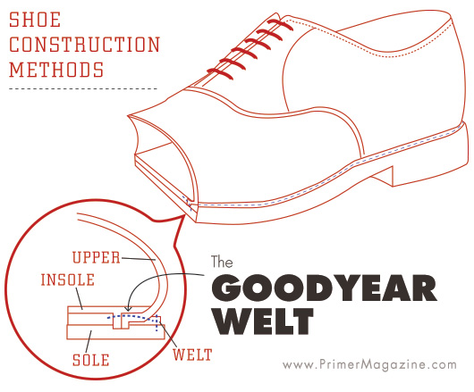
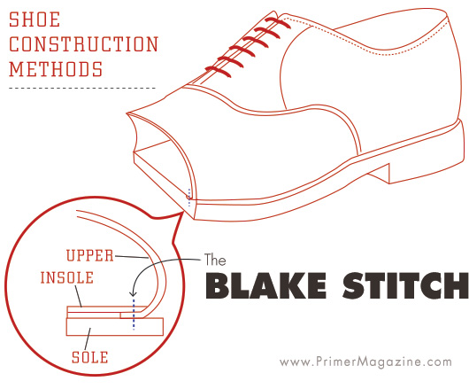

# Shoe Construction

## **Construction Methods**

There are three basic methods of shoe construction: cementing, blake welting, and goodyear welting.  We use both, Blake and Original Goodyear production methods. Each of them has its advantages, and defines how the sole is attached to the upper.&#x20;

### &#x20;

### **Goodyear Welting**

Original Goodyear welting is the oldest, most labor intensive, and most durable of the three methods of construction.&#x20;


Manufacturing process of a Goodyear Welted shoe


For more than 300 years, the Original Goodyear Welting process has been associated with excellence and superior workmanship. More than **60 craftsmen are involved** in the process of manufacturing one of our Goodyear shoes, and they use between **25 and 50 different elements and pieces**. All this involves a process with more than **120 handcrafted phases**, from beginning to end.

In 1872 Charles Goodyear invented a machine capable of stitching the welt to the insole, thus revolutionizing the quality of footwear worldwide. Due to its longstanding heritage, little needed maintenance, waterproof durability and clean aesthetic, Goodyear method is highly valued in the high-end shoe market.

The welt refers to a strip of leather that is sewn around the perimeter of the upper of the shoe, onto the insole. The outer sole is then sewn to the welt, as opposed to being attached directly to the upper like the Blake stitch method.&#x20;

The cavity created by the welt between the insole and the outer sole is filled with cork, another natural product which provides insulation, protection, and comfort: as you wear the shoe, the cork filler takes an impression of your foot, like memory foam. This provides unparalleled comfort and support when compared to cheaper forms of manufacturing.

### **Blake Stitching**

Experts recognize Blake-stitched shoes by their soles: the insole is sewn directly to the outsole. Blake-stitched shoes such as loafers don’t have cork bottom fillers or any additional layers of insulation.

A special sewing machine is used for this shoe production method—this machine directly stitches through the outsole, insole and bottom edge of the shoe shaft, connecting them without using welts.

Blake-stitched shoes don’t feature cork bottom fillers or additional layers of insulation, like Goodyear shoes. Loafers are a prime example of this kind of shoe. As opposed to Goodyear-welted men’s shoes, blake-stitched shoes are assembled in fewer steps.


Manufacturing video of a Blake Stitched double monk pair of shoes


### Cementing

Cementing is the fastest, and most common method of attaching the sole of a shoe. Once the upper is shaped and completed around the last, the sole is attached with an adhesive, and no welting is used.

Slippers fall under this category, as well as some other Men Dress rubber soles, like the _Running_ and _Sportwedge_ rubber soles.

## **Sole Units**

From the formal and classic _**Plain Leather Sole**_, to the new casual _**Running Rubber Sole,**_ each one has its own personality.&#x20;

We offer dozens of different sole units, each sole unit style usually comes in a variety of colors. Sole units are usually restrained to a specific shoe lasts, shoe styles or construction methods.&#x20;

### Choose Between Soles

To alternate between soles, look for the _Sole Selection Widget_, located on the bottom right of your 3D Designing Tool.

### Looking for more sole units?

Then you should definitely look for our custom **BULK** and **RTW** **(Ready-to-Wear) production programs.** We have plenty of different shoe lasts, shoe styles, shoe patterns, sole units… etc for you to choose from.

## **Shoe Lasts**

At Bespoke Factory, we construct shoes on a wide variety of Last. Lasts are foot-shaped forms that provide shoemakers with a foundation for building a shoe. The last used during shoe assembly can affect the overall fit of a shoe, as well as the aesthetics and look of the shoe.

Some shoe styles can be assembled using different lasts, and others only with a specific one. For instance, a pair of Goodyear Welted Oxfords can be ordered using different shoe lasts, each one with its own unique characteristics.

When selecting a shoe style on the 3D Designing Tool, you will be asked to choose the Last to be used, if it applies.

## Heel Height Options

For Goodyear production, three heel options are available. The **standard heel**  is approximately 26 mm (1 inch). With the **higher heel** you can add up 8 mm (0.34 inch) in height for a total of 34 mm (1.34 inch).  And the **pitched heel**, with a stilish slant.&#x20;

