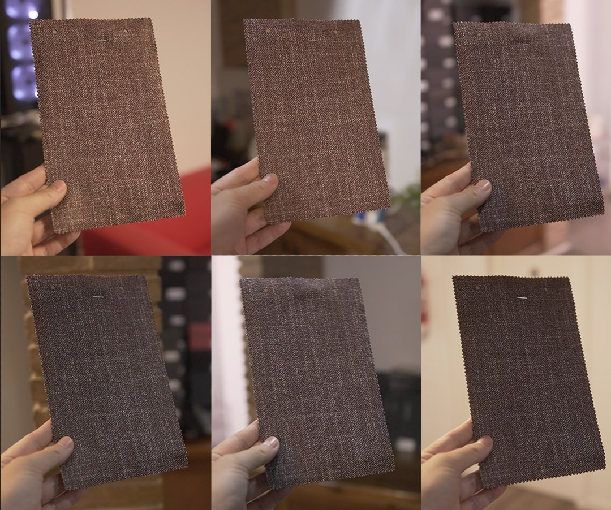

# Material Perception

In the video below, we demonstrate how the appearance of our materials can vary under different lighting conditions. As you watch, you'll see how the color and brightness of the same piece of material change as it is moved 360º over the same spot. This visual example highlights how various factors can influence the perception of our materials.

<figure><figcaption></figcaption></figure>

**Why Do Materials Look Different on Screens?**

Even though we strive to create the most accurate digital representations of our materials, several factors can impact how they appear on your screen compared to real life:

* **Device Monitor Calibration and Brightness:** Every device screen is calibrated differently, which can cause colors to appear slightly different from one screen to another. You might not notice this until you compare two devices side by side.
* **Ambient Lighting:** The lighting conditions in your environment significantly affect how colors are perceived. Whether you're inside or outside, under white or warm light, the material may look different. Poor lighting can also alter your perception of color.
* **Individual Color Perception:** Each person perceives colors uniquely due to physiological differences. This means that even under the same conditions, two people might see the same color slightly differently.

**Why This Matters**

We want you to have the best experience with our customization tool and to understand that slight variations are natural and expected. The video illustrates how a single piece of material can look dramatically different with just a change in lighting. This is a reminder that when you compare the digital representation of a material on your screen to the actual product, some variations are inevitable.

#### Watch the Video



Thank you for understanding these nuances. We are committed to delivering the highest quality products, and we hope this explanation helps in appreciating the complexity and beauty of our materials.

For any questions or concerns, please feel free to contact our support team.
