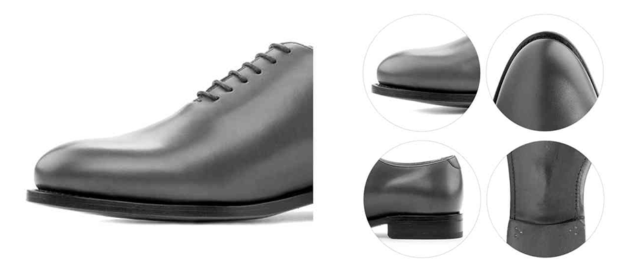

# 48h Rush Production

## Key Features

* 👟 **Ultra-Fast Production**: Shoes are crafted within 48 working hours, starting the next working day after payment confirmation.
* 🎨 **Simplified Customization**: Focused on speed, with fewer options for materials and features.
* 🧵 **Material Options**: Luxe Calf + Painted Vitelo leathers, with optional burnishing, and hand-painted patina textures (+1 extra production day).
* 🏷️ **Private Label**: All shoes feature your brand's logo on the soles and insoles. You can also add heel initials, a sole signature, and private-label packaging or accessories.
* ⚒️ **Construction**: Built using Blake Luxury Flex construction on the Zurigo last, with 3 sole styles available.
* ✅ **Same Quality**: Shoes are crafted with the same premium quality as the Standard MTO service.

***

## What is 48h Rush?

**48h Rush** is a custom production service for made-to-order (MTO) shoes that guarantees an extremely fast turnaround time of just **48 working hours**. This service is available for a select range of **Blake Luxury Flex** men's dress shoes, offering streamlined customization options with a reduced set of materials and features.

**48h Rush** is faster than both **MTO Standard** (3-weeks) and **Fastlane** (average 7 business days, and up to 10 business days during peak season), providing a rapid production time while still delivering the same craftsmanship, attention to detail, and high-quality finishes.

<figure><figcaption></figcaption></figure>

#### **Production Lead Time 48h**

Once we receive your order and payment, production starts on the **next working day**, and your shoes will be completed within the following **two working days**. For example, if we receive your order on Monday, production will begin Tuesday, be completed Wednesday, and ready by Thursday morning.

Please note, the 48-hour timeframe covers only production. Pre-production, fulfillment and delivery times are excluded

#### **Private Labeled for Your Brand**

As with our other services, **48h Rush** orders can be customized with your brand's name or logo. You can engrave your logo on the **insole** and **outsole**. If you've developed custom stamps for other MTO programs, those logos will be reused for **48h Rush** orders.

Additionally, you can opt for private label packaging and accessories like custom **shoe boxes**, **dust bags**, **shoe horns**, and **shoe care kits**.

#### Same Quality

All 48h Rush styles use **Blake Luxury Flex** shoe construction method. The only difference between **48h Rush** and our Standard MTO service is the turnaround time. Rest assured, we use the **same premium materials** and craftsmanship for every order, ensuring your shoes are identical in quality to those from our MTO program.

***

## Customizing Options

Since the production process for **48h Rush** is streamlined for speed, customization options are more limited. You can choose from a select range of men’s dress shoe styles, but with a reduced set of materials, soles, and color options. For more extensive customization, we recommend choosing **MTO Standard**.

#### Available Styles

For 48h Rush, we offer the same selection of men's dress shoes already available in Fastlane. We are constantly reviewing and updating the styles based on availability, so be sure to check for the latest options.



#### Shoe Last: Round Zurigo

For 48h Rush, the available shoe last is **Zurigo** last. Our best seller, and the most classic one. It is known for its elegant and timeless silhouette, ensuring a refined fit and stylish look for your shoes.

<figure><figcaption></figcaption></figure>

#### Sole Style & Color

We offer different sole options for 48h Rush orders: **leather soles** (in different colors), **leather soles with rubber reinforcement** (in different colors), and **dainite rubber sole** (black).



#### Outsole Color

The sole edge can be customized in natural, brown, black or brick. However, the welt style can not be modified, all 48 Rush shoes are manufactured using the city welt.



#### Laces Style & Color

As for the laces, you can choose between **round** or **flat** styles, in different colors, to match your preference.



#### Lining: Dark Brown

The shoe lining for all 48h Rush orders is **dark brown**. This lining color is consistent with our Fastlane production and is not customizable, ensuring an elegant interior finish.

<figure><figcaption></figcaption></figure>

#### Materials

For 48h Rush orders, you can choose from a select range of premium **Luxe Calf** and **Painted Vitelo colors.**



#### Burnishing Effect

Additionally, Burnishing is available as a finishing option, offering a rich, antiqued effect that enhances the leather’s appearance, adding depth and character to your shoes.



#### **Hand Patinted Patina**

**Patina finishing** is also available on 48h Rush, but please note that it will require one additional day of production time.



#### Heel Initials & Sole Signature

For an added touch of personalization, you can choose to engrave **initials on the heel** and add a **custom signature on the sole**. This option allows you to make your shoes truly unique.



## Available Sizes

**48h Rush** offers a wide range of sizes, typically from **39 EU (6 US)** to **48 EU (15 US)**, and widths **D** and **EE**.

Please use our **real-time stock availability widget** to check the current availability of specific sizes and styles.



## How to order?

To place a **48h Rush** order, simply browse the **48h Rush** category on our 3D Design Tool, choose a style, and proceed with the ordering process. Real-time stock availability is shown on the platform, so you can check whether the size and style you want is available. **Once you place the order and submit payment**, production will begin the next working day.



If the style is currently "In Stock" or "Low Stock" you will be able to design and submit the order to production. Otherwise, if the stock widget says "Out of Stock", you won't be able to submit the order to production. In that case, please, wait until the style is back In-Stock to place the order.



We will be periodically replacing the stock, and adding new shoe styles to the Fast Lane & 48h Rush collection, so please, stay tuned in on this categories.


Remember, **stock is limited, and can fluctuate from the moment you design the shoes and the moment you submit the payment.** We strongly suggest to submit the payment and send the order to production as soon as possible, to avoid out-of-stock issues.


For the rest part, the same design and order process applies, as any Standard MTO item. On the configuration screen you will notice that customizing options are limited compared to the Standard MTO program. If a material or design feature is not there, then it means we can not accomodate that particular option on the 48h Rush program.



## FAQs

#### What construction method is used for 48h Rush shoes?

All 48h Rush shoes are handcrafted using Blake Luxury Flex construction exclusively, ensuring high-quality, durable footwear.

#### Will 48h Rush shoes be engraved with my brand name or logo?

Yes, 48h Rush orders will feature your brand's logo on both the insole and outsole, just like in our Standard MTO and Fastlane programs. If you’ve already developed custom stamps for your account, we will use them for your 48h Rush orders as well.

**How does the 48-hour production time work?**

Once we receive your order and payment, production starts on the **next working day**, and your shoes will be completed within the following **two working days**. For example, if we receive your order on Monday, production will begin Tuesday, be completed Wednesday, and ready by Thursday morning.

Please note, the 48-hour timeframe covers only the production part, starting the next working day after the order is confirmed by the factory, and ending when the production is completed, two working days later. Fulfillment and delivery times are excluded and may vary.

**How does 48h Rush differ from MTO Standard or Fastlane?**

The primary difference is the production speed. 48h Rush is designed for faster turnaround times (48 working hours), while MTO Standard offers full customization options with a longer production timeline, and Fastlane allows slightly more customization with an average production time of 7 business days, and up to 10 business days during peak season.

#### Why can't I customize my shoes with all the options available in the Standard MTO program?

48h Rush is a streamlined service for speed, so only a select range of materials and options are available. If you require more extensive customization, please opt for MTO Standard or Fastlane

**Can I choose a specific sole or welt style?**

48h Rush offers a limited selection of soles. If it is not available on the sole options, it is not feasible at the moment.

#### The shoe style that I want is not listed for 48h Rush production. How is that?

We are constantly adding and removing styles for 48h Ruh production. The styles and sizes that are currently available to order are listed on the 48h Rush category. If the shoe style is not listed there, it means that is not available for 48h Rush production. In that case, please, check our standard MTO services to submit your order.

#### The specific item that I want to order is out-of-stock. When will it be in stock again?

We try to minimize this situation by using automated re-stock ordering methods in our backend, so there is always stock available on all sizes. However, in certain situations, specific sizes might run out of stock eventually, for a short period of time. In that case, please, wait until that specific style is back in-stock to place the order.

#### What is the difference between "In Stock" and "Low Stock"?

The "Low Stock" tag means that there are just 1 or 2 pairs left in stock. "In Stock" means that we have more than 2 units in stock. In both cases, you will be able submit the order to production.

#### Can initials be engraved on the heel and sole?

Yes, you can engrave your initials on the heel, and personalize the sole with your custom signature, just as any other MTO order.

#### Can I use custom packaging and accessories on 48h Rush orders?

Yes, the same private label packaging and accessories are available, just as any other MTO order.

#### I placed a 48h Rush order a few hours / days ago, but when I try to pay for it through my backoffice, it says that the item is currently out of stock. How is this possible?

Stock is limited, and can fluctuate from the moment you design the shoes and the moment you submit the payment. Our stock is modified when an order is paid. This means that, until the payment has been received, the unit you are trying to purchase will remain fully available to other customers as well.

#### Need Help? More questions?

We are here to help. Please, get in touch with your account manager through our [Help Desk](https://support.bespokefactory.com/) should you have any questions or concerns.
