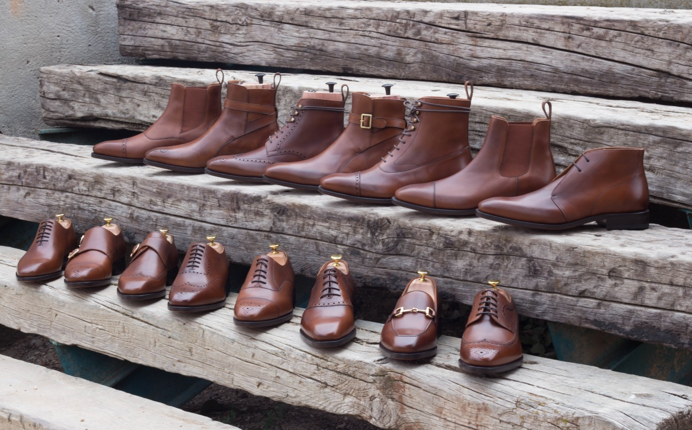

# Pricing & Production

## Introduction

We provide brands with a versatile and comprehensive private label production solution, which might be complex to understand at a first glance. These are the key aspects of our production offer:

* Using your own label, you will be able to produce with us from **one single unit** (Made-to-Order) to BULK orders (**small batches**).
* Our default **MTO / BULK** styles catalog includes dozens of shoe styles and accessories, like Derby Shoes, Sneakers, Chelsea Boots, Slippers, Duffle Bags, Cigar Cases, etc.
* Each of those base styles can be customized and ordered with a large amount of variables: shoe lasts, materials, sole units, etc. We estimate that +60 Billion different designs can be accomplished using our base offer.
* We also also offer a **rapid** MTO production service called [FastLane](fast-lane.md). Fully private labeled Goodyear Welted shoes, handcrafted using our own partially pre-produced units in stock. Average production time is **7 business days**. During peak season — **April to July** and **December** — it may increase to **up to 10 business days**.
* Additionally, we now offer [**48h Rush**](48h-rush-production.md) , the fastest private-label production service in our portfolio, delivering shoes in just 2-3 business days. This service provides limited customization and uses pre-produced components, offering quick turnaround without compromising on quality.
* Besides the above, if you are looking to order **BULK (small batches)** to create your own Ready-to-Wear collections, we can also help you develop and produce your own custom styles, with custom shoe patterns, custom shoe lasts, custom materials, etc.

Let us introduce first the [available ordering methods and production terms](./#production-methods) (MOQ, prices, turnaround) and then talk about which are [the available styles](./#available-styles) that you can order from us.

## Production Methods

As previously introduced, using your own label, you will be able to produce with us from one single unit (Made-to-Order) to small batches of BULK orders. See the differences and peculiarities of each production method below, as well as how the ordering process looks like.

### MTO (Single Orders)

MTO (Made-to-Order) refers to single order production, that is, you submit orders one by one, and they are produced individually, following your specifications.

#### How To Submit MTO orders?

You can customize and submit single orders using your [3D Designing platform](../../admin-backoffice/designing-tools-and-galleries/3d-designing-tool.md) and the [Get Inspired Gallery](../../admin-backoffice/designing-tools-and-galleries/get-inspired-gallery.md). Learn [how to submit a new MTO order](../../admin-backoffice/submit-a-new-order/) using your 3D Designing Tool.

### Fast Lane (Single Orders)

‘FastLane’ is a rapid Made-to-Order production service for individual (single) MTO Goodyear Welted orders. **Average production time is 7 business days**, but with a slightly limited number of customizing options.

Shoe parts are partially pre-produced on our side. They are kept in-stock in our warehouse, and then finished after your order. Fastlane orders average **7 business days** in production. During peak season — **April to July** and **December** — production time may increase to **up to 10 business days**. Production is handmade, so some orders may take less time and some may take more. Learn more about [Fastlane](fast-lane.md).

#### How To Submit 'FastLane' orders?

You can customize and submit single orders using your [3D Designing platform](../../admin-backoffice/designing-tools-and-galleries/3d-designing-tool.md) just as any standard MTO order. Look for the category 'FastLane'. Available styles and sizes for FastLane ordering will be displayed within the category.


[fast-lane.md](fast-lane.md)


### **48h Rush (Single Orders)**

**48h Rush** is our fastest production service, delivering custom private-labeled shoes within just 48 working hours. This service features Luxe Calf and Painted Vitelo leathers, Blake Luxury Flex construction, and fewer customization options for rapid production.

Orders for 48h Rush are completed within two working days from the next working day after payment confirmation, and shoes are crafted using pre-produced components to ensure quick turnaround without sacrificing quality. Pricing for 48h Rush is the same as Standard MTO, with no added cost for faster production. Learn more about **48h Rush**.

#### **How to Submit 48h Rush Orders?**

You can submit orders through your 3D Designing platform under the '48h Rush' category. A real-time stock availability widget will show whether your preferred style and size are available for this service. If the item is in stock, production will begin the next working day


[48h-rush-production.md](48h-rush-production.md)


### BULK (Small Batches & Ready-to-Wear)

BULK production refers to order batches of 10 or more items per style. That is, ordering the same item / design combination in different sizes, with a MOQ of at least 10+ pairs per batch.

This production method enables brands and boutiques to swiftly design and produce unique and affordable ready-to-wear collections, to sell on their own store or online boutique.

#### How To Submit BULK orders?

Firstly, you can submit BULK orders using your [3D Designing platform](../../admin-backoffice/designing-tools-and-galleries/3d-designing-tool.md) and the [Get Inspired Gallery](../../admin-backoffice/designing-tools-and-galleries/get-inspired-gallery.md), using same process as submitting an MTO order. During the checkout process, you will be able to choose between MTO and BULK production, presenting both prices and the BULK minimum order quantity. Select BULK production and enter the size run you would like to produce.

Secondly, to extend our styles offer, we compiled a repository of dozens of seasonal shoe styles, with unique sole units, shoe lasts, materials, etc. These styles can only be ordered in BULK (specific MOQ applies to each specific SKU). See our [Ready-to-Wear Platform](../../admin-backoffice/designing-tools-and-galleries/ready-to-wear-gallery.md) article.

Lastly, we can also [develop and bulk produce your own shoe styles](../developing-custom-styles.md) (shoe collections) based on your own specifications: your own shoe lasts, shoe patterns, personalized hardware and sole units, etc. New styles developed will remain exclusive for your brand

## Available Styles. What can we produce for you?

Without any development on your side, you are entitled to customize and produce orders using our **Base Styles,** a comprehensive repository of dozens of men's and women's shoes and accessories.

Lastly, we can also help you develop and produce your own **Custom Styles:** custom shoe patterns, shoe lasts, etc. These could be developed exclusively for you.

|      Styles     | <p>MTO</p><p>(custom single order)</p> | <p>BULK</p><p>(batch order)</p> |
| :-------------: | :------------------------------------: | :-----------------------------: |
| Our Base Styles |                 **YES**                |             **YES**             |
|  Custom Styles  |                **YES\***               |            **YES\***            |

\*Specific MOQ and initial setup / development costs might be required

### Base Styles

We offer a full array of shoe styles for Men and Women: dress shoes, casual shoes, sneakers, slippers, etc. Additionally, we also offer luxury bags styles and small leather goods, as well as accessories like belts.



All these base styles can be customized using the [3D Designing Tool](../../admin-backoffice/designing-tools-and-galleries/3d-designing-tool.md) with the available configuration options (different shoe lasts, shoe pieces, materials, finishing, etc). Base styles can be ordered one-by-one (MTO) as well as in BULK (small batches of at least 10 units per style).

### Custom Styles

In addition to the previously mentioned styles, we will be glad to [**develop and produce your own shoe styles**](../developing-custom-styles.md) (shoe collections) based on your own specifications: your own shoe lasts, shoe patterns, personalized hardware and sole units, etc. New styles developed will remain exclusive for your brand.


[developing-custom-styles.md](../developing-custom-styles.md)


## Manufacturing Prices

All manufacturing prices are shown in EUROS. Shipping costs are not included. Also, VAT/TAX (if applicable) is excluded.

### Dynamic MTO & BULK Prices

Available on the Admin 3D Designing Tool, this feature is mainly conceived to make the production of ready-to-wear collections and MTO (single order) an easy and streamlined process.

Manufacturing prices for MTO (single order) production as well as wholesaler costs for BULK production (small batches of 10 items per style) are shown on the top right corner of the 3D Design Tool.


The dynamic price widget provides a real-time bulk price quotation based on the style combination in process that you see on-screen. Right after each modification made (materials, sole unit, accessories…etc) prices are automatically re-calculated in real-time



### Pricing Tables

Pricing tables for MTO and BULK production are available on your Admin Backoffice:

```
Tools & Pricing > MTO / BULK Price List
```

Here you will find MTO production costs of all our standard items, as well as approximate costs for bulk ordering depending on the materials used.


## Manufacturing Time

You can [review live manufacturing status of your orders](../../admin-backoffice/manage-your-orders.md#manufacturing-status) using your Admin Backoffice. Also, you have access to the manufacturing comments and logs of each order, to help you visualize and understand the current production step they are involved in.

### MTO Orders

The average turnaround time for Standard MTO orders is approximately 4 weeks for shoes. For [Fastlane](fast-lane.md) MTO orders, the average production time is 7 business days. During peak season — April to July and December — production time may increase to up to 10 business days. As all production is handmade, some orders may take less time and some may take more.

Additionally, bear in mind that some extra customizations (ie. having your initials engraved on the heel) and artisan methods (ie. hand made patina finishing) are more time consuming, and might result on extra manufacturing time.

When the order is finished, we will ship it to the provided shipping address. You will receive an email notification with the associated tracking number so you can track the status of the parcel online.

### BULK Orders

The average turnaround time for BULK orders is approximately 8 weeks. Special requirements and specific turnaround times might apply, please [contact us](../../get-help/contact-us.md).
