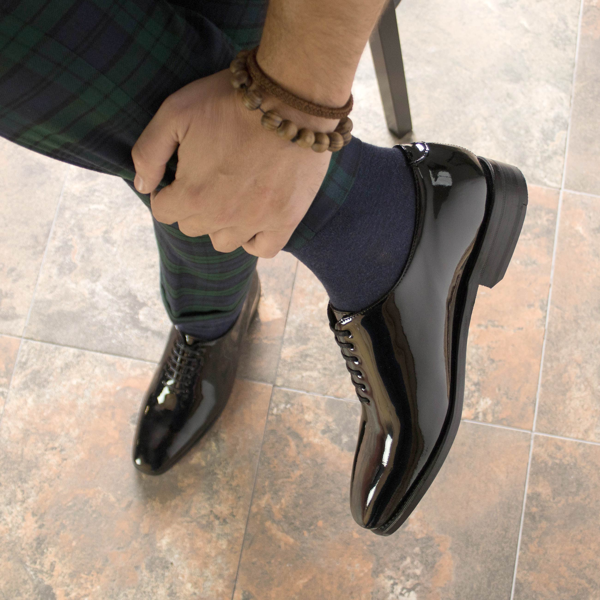
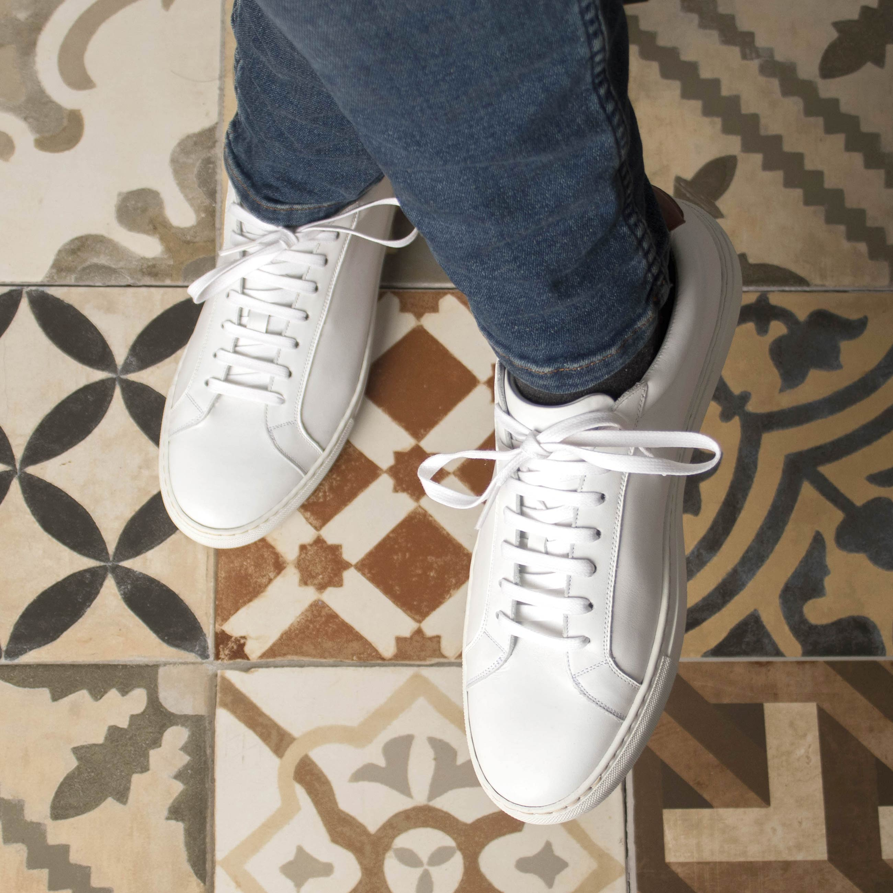
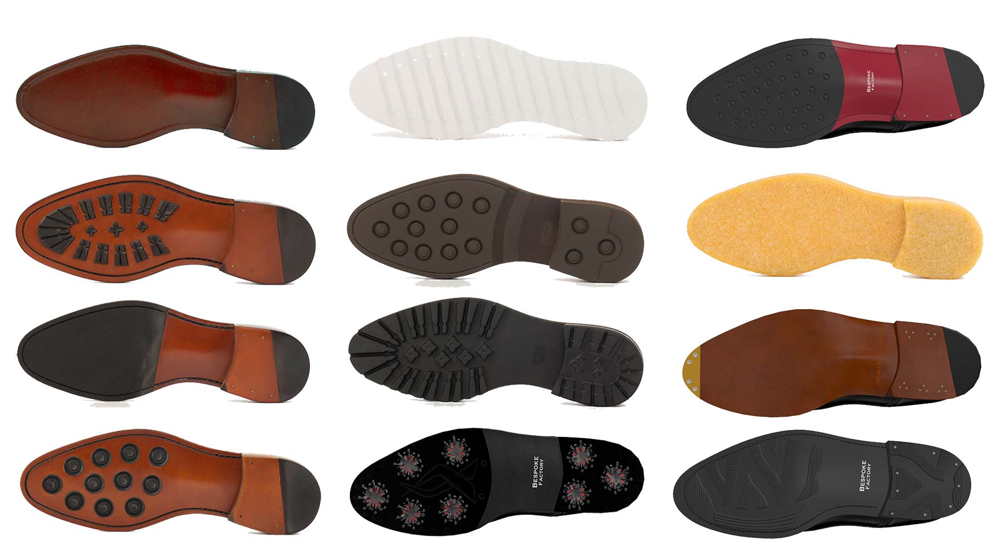
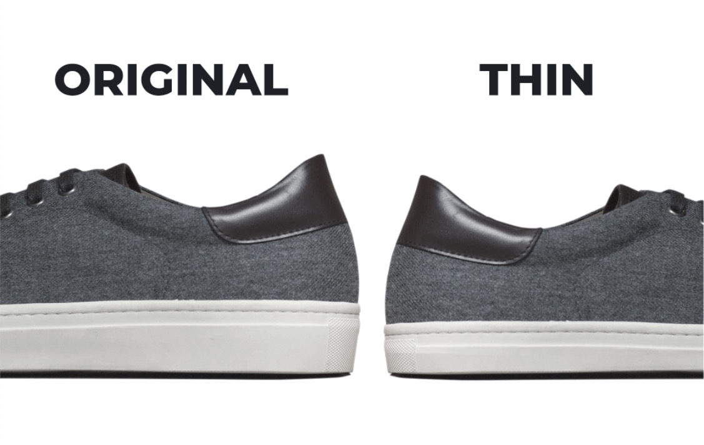
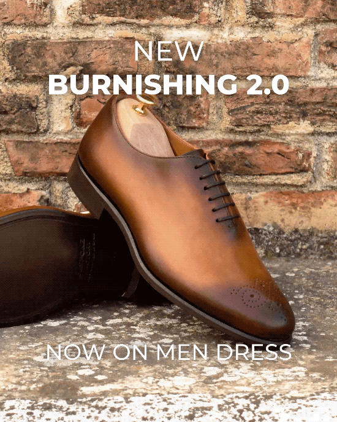

# Fastlane Production

## What is Fastlane?

Fastlane is a custom production service for single MTO orders. It offers an average production time of **7 business days**. During peak season — **April to July** and **December** — production time may increase to **up to 10 business days**.

Fastlane items are partially pre-produced on our side and kept in stock in our warehouse to be finished after your order. That's the only reason we can offer such a fast turnaround time.

Fastlane is just faster than a Stadard MTO order, but both are virtually identical. Same materials, same production processes, and same attention to detail and finishing, just way faster!

<figure><figcaption></figcaption></figure>

### **Blazing Fast Production**

Fastlane orders have an average production time of **7 business days** thanks to the availability of partially pre-produced stock in our warehouse. During peak season, production time may increase to **up to 10 business days**.

### **Fastlane production time**

Fastlane orders are produced by hand, so turnaround times are always **averages**.

The average production time for Fastlane orders is **7 business days**.

During peak season — **April to July** and **December** — production time may increase to **up to 10 business days**.

Some orders may take less time. Some may take more. That is normal in a handmade production process.

### **Private Label & Branding**

Fastlane orders can be engraved as usual with your brand name or logo on the insole and outsole. If you have already developed stamps for the MTO program, they will be re-used for FastLane orders.

Additionally, you can develop private label packaging and accessories like shoe boxes, dust bags, shoe horns, shoe care kits, etc.

### **Hybrid MTO Production**

Fastlane item parts are partially pre-produced in advance and stocked in our warehouse.

For instance, Goodyear shoes: upper cuts are sewed and kept ready to be molded over the last. Once the order is paced, the upper is lasted and attached to the sole unit selected.

Each order is then hand painted and finished following your specifications.

### **Goodyear Welted. Same Quality**

The only difference between a Fastlane MTO and the same item ordered through our Standard MTO program is the turnaround time.

Fastlane items are identical to Standard MTO orders. We use the same materials and processes. That includes the same raw leathers, hand painting processes, sole units, etc.

## Fastlane Customizing Options

Fastlane shoe customizing options are immense. We offer a wide variety of options.

### Shoe Lasts

For Men's dress shoe you will be able to choose between all our shoe lasts: Zurigo, Monti, Savile and Belgravia

<figure><figcaption></figcaption></figure>

### Available Styles

You can choose between dozens of shoe styles and accessories, and we are constantly adding more.

<figure><figcaption>
Available Fastlane styles
</figcaption></figure>

### Special Styles

Fastlane Special Styles are unique and highly sought-after designs that feature specific material combinations not typically available within the standard Fastlane program. These styles have been curated based on their popularity and distinctive appeal.

While Fastlane Special Styles have certain fixed elements that set them apart, they still offer limited and specific customization options, such as the choice of soles or shoelaces.

These exceptional styles allow you to enjoy the convenience and speed of Fastlane while embracing distinctive materials and designs that have proven to be customer favorites.

<figure><figcaption>
Whole Cut full black patent leather
</figcaption></figure>

<figure><figcaption>
Low kick full white nappa
</figcaption></figure>

### Soles

You have the flexibility to choose from the full array of sole and welt styles to customize your Fastlane order. From the classic leather sole to dainite rubber soles.

However, please note that the Art Sole, our hand-painted masterpiece, is exclusively available in our Standard MTO program.

<figure><figcaption></figcaption></figure>

#### Flex Soles

Flex soles are a footwear innovation that enhances comfort and flexibility through new components and technology. While externally resembling traditional outsoles, Flex soles offer unparalleled comfort and ease of wear in Goodyear welted shoes.

On Fastlane you can use any of our Flex soles, with the exception of the Art Sole.



#### Thin Sneaker Cupsole

We have two types of cupsoles: original and thin. With a difference of 8 mm in height, or 0.31 inches, the new thinner rubber sole adds a low-profile look to each style

This feature is available through Fastlane, so you can order sneakers using any of the two cupsole styles.

<figure><figcaption></figcaption></figure>

### Welt styles

In well-constructed shoes, the welt is a strip of leather that runs along the perimeter of the outsole. Its primary function is to attach the upper to the outsole and create greater durability. Our 3 goodyear welt styles are available in Fastlane too.

<figure><figcaption></figcaption></figure>

### Heels

Different heel styles for men dress shoes are also available through Fastlane.

The "Original Heel" provides a classic height of approximately 26 mm (1 inch), delivering timeless elegance.

With the "Higher Heel" option, you can subtly elevate your look by adding up to 8 mm (0.31 inch) in height, reaching a total of 34 mm (1.34 inches). While the differences are minimal, this choice allows for a touch of extra height without compromising fitting or comfort.

Lastly, the "Pitched Heel," also known as the "Slanted Heel," introduces a subtle downward slope from the back to the front, enhancing the shoe's sophistication and creating a sharper silhouette for a refined appearance. Each heel style offers its unique charm, ensuring you can find the perfect match for your desired aesthetic and comfort level.

<figure><figcaption></figcaption></figure>

 

### Sizes and Widths

In our Fastlane collection, we're delighted to provide an extensive range of sizes to ensure that every customer can enjoy the perfect fit. Our sizing usually spans from 39 EU (6 US) to 48 EU (15 US), offering a broad spectrum to accommodate various foot sizes and preferences. Additionally, we offer both D and EE widths, allowing you to tailor your choice to your individual comfort requirements.

We maintain a well-stocked inventory of all sizes and styles in our Fastlane collection, however, check our backoffice for updated stock and size availability.

### Materials & Finishings

When orderning a Fastlane shoes, only a few material choices are available. In the case of Goodyear Welted shoes you can choose between Box Calf and Painted Vitello.

<figure><figcaption></figcaption></figure>

<figure><figcaption></figcaption></figure>

#### Burnishing effect available

Burnishing is a meticulous finishing technique that we also offer in our Fastlane program. It involves adding an exquisite antiqued effect to leather shoes, creating captivating variations in shades. Each shoe is individually treated, enhancing the intricate details like sewing lines. The result is nothing short of astonishing, as the patina workshop brings out the full beauty of this mesmerizing process, transforming your shoes into unique works of art.

<figure><figcaption></figcaption></figure>

#### Hand Painted Patina Workshop

All Fastlane orders are hand painted at our Patina Workshop. You can order any color and texture available on the MTO program.

#### Exclusive «Reverse» Patina

Only available on Fastlane orders, the new hand painted «Reverse Patina» gracefully mixes two color tones to create an outstanding color gradient that distills craftsmanship and uniqueness, and it’s available in 7 different colors.

## How to order?

Look for the Fastlane category on your MTO platform and submit your first order! Styles available for Fastlane production are dynamic, that is, they change over time based on the stock available.

Stock is monitored in real time to support the average Fastlane production time. Real-time stock quantity is displayed during designing and checkout processes for each particular style and size combination.



If the style is currently "In Stock" or "Low Stock" you will be able to design and submit the order to production. Otherwise, if the stock widget says "Out of Stock", you won't be able to submit the order to production. In that case, please, wait until the style is back In-Stock to place the order.

We will be periodically replacing the stock, and adding new shoe styles to the Fast Lane collection, please, stay tuned in on this category.


Remember, **stock is limited, and can fluctuate from the moment you design the shoes and the moment you submit the payment.** We strongly suggest to submit the payment and send the order to production as soon as possible, to avoid out-of-stock issues.


For the rest part, the same design and order process applies, as any Standard MTO item. On the configuration screen you will notice that customizing options are limited compared to the Standard MTO program. If a material or design feature is not there, then it means we can not accomodate that particular option on the Fastlane program.

## Behind The Scenes. How It's Done?

Fast Lane shoe parts (uppers and soles) are pre-produced on our side and kept in stock.

Leather is cut and sewed together to create a basic upper. These basic uppers are made of unfinished raw crust leather (no color) in order to be hand painted during the finishing process following the customer requests.

Each upper is specifically made for a particular combination of shoe style + shoe last + size + width. As you can imagine, all these combinations and possibilities add up pretty quickly, and we are forced to maintain a stock of dozens of upper types.

Once a Fast Lane order is placed, it begins its production journey as any other MTO order. The plain upper is molded over the last, attached to the sole and then finished (hand painted) on the patina workshop.

You can think of Fast Lane as a "turbo-charged" regular MTO order. We stock up on these "unfinished" shoe parts on a daily basis, and offer our partners the possibility to use the stock for rapid MTO production.

Design options on these Fast Lane orders might be slightly limited if you compare them to the full range of customizing features available for standard MTO orders. But not fur much!

We try very hard to fill the gap between MTO and Fast Lane design options, so these small differences are expected to be reduced over time.

Understandably, we can not accommodate other special designing requests on these orders. For a full customization control and design options, please, refer to the standard [MTO production method.](./#mto-single-orders)

## Frequently Asked Questions

#### Which construction method is used on Fastlane shoes?

All men's dress Fastlane shoes are handcrafted using Original Goodyear Welted construction.

**What is the difference between a shoe ordered as Standard MTO (4 weeks) vs Fast Lane MTO (average 7 business days, and up to 10 business days during peak season)?**

There is none in terms of construction, quality and finishing. However, Fastlane orders are slightly limited in regards of customizing options, if you compare them with a standard MTO order.

#### Why can't I customize my shoes with this specific sole, materia, design, layout, ornament, embroidery or any other design option not available in my 3D design tool?

Understandably, Fastlane orders can not be designed with the full range of design options available in our standard MTO program, since they are partially preproduced in advance.

For further customization options, please, place a standard MTO order instead

#### Why can't I mix colors on different shoe pieces?

Due to manufacturing constrains, your are not allowed to mix different colors on the same order. That is, all the pieces of the shoe should be made with the same material, texture and color.

It is in our roadmap to allow combination of different patina textures and colors con the same order, stay tuned!

For full customizing options, please, take a look at our standard MTO production service.

#### The shoe style that I want is not listed for Fast Lane production. How is that?

We are constantly adding and removing styles for Fastlane production, and the number of stocked units is continuously changing. We aim to extend the number of styles available for Fastlane production gradually, adding new shoes and boots based on the interests of our partners.

The styles and sizes that are currently available to order are listed on the Fastlane category. If the shoe style is not listed there, means that is not available for Fastlane production. In that case, please, check our standard MTO production program to submit your order.

#### The specific item that I want to order is out-of-stock. When will it be in stock again?

We try to minimize this situation by using automated re-stock ordering methods in our backend, so there is always stock available on all sizes. However, in certain situations, specific sizes might run out of stock eventually, for a short period of time. In that case, please, wait until that specific style is back in-stock to place the order.

#### What is the difference between "In Stock" and "Low Stock"?

The "Low Stock" tag means that there are just 1 or 2 pairs left in stock. "In Stock" means that we have more than 2 units in stock. In both cases, you will be able submit the order to production.

#### Will Fastlane shoes be engraved with my brand name or logo?

Yes, they can be engraved is you want to, just as any MTO order. Insoles are engraved with the same aluminum mold used for standard MTO orders. Outsoles are laser engraved, providing a similar result than standard pressure engraving

#### Can initials be engraved on the heel?

Yes, you can [engrave your initials on the heel](../order-customization.md#engraved-initials-on-the-heel), just as any other MTO order.

#### Can I use custom packaging and accessories on Fastlane orders?

Yes, the same private label packaging and accessories are available, just as any other MTO order.

#### Do I have to develop new stamps specifically for Fastlane production?

No, you don't. Standard MTO shoe stamps are required for Fastlane production, though. That is, if you have already developed stamps for your standard MTO shoe production, the same molds and specifications will be used for any Fastlane order. If this is your first order, you will be asked to purchase the standard shoe stamps development kit.

#### I placed a Fastlane order a few hours / days ago, but when I try to pay for it through my backoffice, it says that the item is currently out of stock. How is this possible?

Stock is limited, and can fluctuate from the moment you design the shoes and the moment you submit the payment. Our stock is modified when an order is paid. This means that, until the payment has been received, the unit you are trying to purchase will remain fully available to other customers as well.

#### Need Help? More questions?

We are here to help. Please, get in touch with your account manager through our [Help Desk](https://support.bespokefactory.com/) should you have any questions or concerns.
